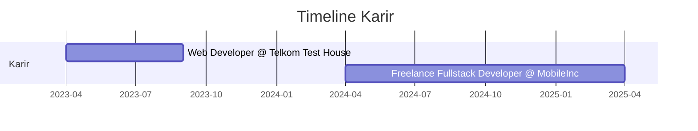

# 👋 Halo, Saya Fadhlu Ibnu

  

## 🚀 Tentang Saya

Saya adalah seorang pengembang perangkat lunak yang bersemangat, dengan fokus pada pengembangan web dan mobile. Saya senang membangun aplikasi yang menarik, efisien, dan berguna bagi pengguna.

- 🌱 Saat ini saya sedang mempelajari **AI & Machine Learning**
- 👨‍💻 Semua proyek saya tersedia di [fadhluibnu.github.io](https://fadhluibnu.github.io)
- 📫 Hubungi saya: **fahluibnua@gmail.com**
- ⚡ Fun fact: **Saya suka bermain gitar di waktu luang**

<!--
## 📊 GitHub Stats

  

  

-->

## 💻 Kemampuan Teknis

  <h3>Frontend</h3>
  
  
  
  
  
  
  
  
  <h3>Backend</h3>
  
  
  
  
  
  
  
  <h3>Mobile Development</h3>
  
  
  
  
  <h3>Database</h3>
  
  
  
  
  <h3>DevOps & Tools</h3>
  
  
  

## 📈 Kontribusi

  

## 🏆 Pencapaian

<!-- - 🥇 Juara 1 Kompetisi Web Development Tingkat Nasional (2023)
- 🥈 Runner-up Hackathon ASEAN 2024
- 📜 Google Associate Android Developer Certification
- 📜 AWS Certified Solutions Architect
- 🏅 100+ Repository di GitHub dengan 500+ stars -->

## 🔥 Proyek Unggulan

<table>
  <tr>
    <td width="50%">
      <h3 align="center">Mango Leaf Detection</h3>
      

        
      

      

        
        
        
        
        
        
      

      
Sistem deteksi penyakit pada daun mangga menggunakan Computer Vision dan Deep Learning

    </td>
    <td width="50%">
      <h3 align="center">SIMAJA</h3>
      

        
      

      

        
        
      

      
Sistem Informasi Manajemen Jadwal dengan fitur penjadwalan otomatis dan notifikasi

    </td>
  </tr>
  <tr>
    <td width="50%">
      <h3 align="center">Mahabisa</h3>
      

        
      

      

        
        
        
        
        
        
        
      

      
Aplikasi Manajemen Bimbingan dan Konseling Siswa berbasis web

    </td>
    <td width="50%">
      <h3 align="center">EduSen</h3>
      

        
      

      

        
        
        
        
        
      

      
Aplikasi mobile edukasi sensitif yang menyediakan materi pembelajaran interaktif

    </td>
  </tr>
  <tr>
    <td width="50%">
      <h3 align="center">Perpustakaan Laravel</h3>
      

        
      

      

        
        
        
        
      

      
Sistem Informasi Perpustakaan dengan fitur peminjaman, katalog dan manajemen buku

    </td>
    <td width="50%">
      <h3 align="center">Steganography</h3>
      

        
      

      

        
        
        
      

      
Aplikasi penyembunyian pesan rahasia dalam gambar menggunakan teknik steganografi

    </td>
  </tr>
  <tr>
    <td width="50%">
      <h3 align="center">WDC 2023</h3>
      

        
      

      

        
        
        
        
      

      
Proyek untuk Web Design Competition 2023 dengan desain responsif dan interaktif

    </td>
    <td width="50%">
      <h3 align="center">Diet Food App</h3>
      

        
      

      

        
        
        
        
        
      

      
Aplikasi mobile untuk membantu pengguna merencanakan diet dengan rekomendasi makanan sehat

    </td>
  </tr>
  <tr>
    <td width="50%">
      <h3 align="center">Website PDS</h3>
      

        
      

      

        
        
        
        
        
      

      
Website profil perusahaan dengan desain modern dan animasi yang menarik

    </td>
    <td width="50%">
      <h3 align="center">SEMENT - Shop Management</h3>
      

        
      

      

        
        
      

      
Sistem manajemen toko untuk inventaris, penjualan, dan laporan keuangan

    </td>
  </tr>
  <tr>
    <td width="50%">
      <h3 align="center">Template Furniture</h3>
      

        
      

      

        
        
        
        
      

      
Template website e-commerce untuk toko furniture dengan UI yang menarik

    </td>
    <td width="50%">
      <h3 align="center">I-Secret Profile</h3>
      

        
      

      

        
        
        
        
        
        
      

      
Website profil organisasi I-Secret UNNES dengan animasi modern dan responsif

    </td>
  </tr>
</table>

## �‍💻 Pengalaman Kerja

  

### 🚀 Highlight Proyek Profesional

<table>
  <tr>
    <td width="20%" align="center">
      
    </td>
    <td>
      <b>Website PDS (Pengendali Dokumen SMM)</b> 
      This project is the result of an internship at Telkom Test House. This project gave me a valuable lesson where a programmer does not only focus on making codes. But programmers must also mature the system flow before the coding stage. At that time to mature the system flow I used UML such as Use Case, Activity Diagram, Class Diagram, Flowchart and ERD.
      • Mengembangkan platform untuk Telkom dengan Laravel, MySQL dan Tailwind CSS 
      • Mengimplementasikan sistem manajemen dokumen dan dashboard analitik real-time 
      • <i>Teknologi: PHP, Laravel, JavaScript, Tailwind CSS, MySQL</i> 
      • <a href="https://github.com/fadhluibnu/website-pds">Lihat repository</a>
    </td>
  </tr>
</table>

## 🌐 Sosial Media

  
 
 

  

